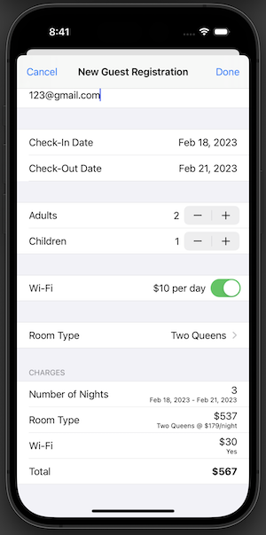
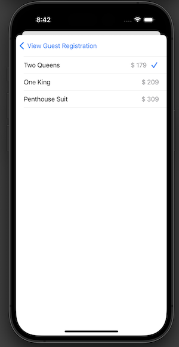
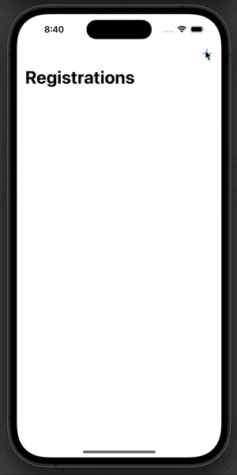

# Hotel Manzana
This app allows for employees of a hotel to register guests as well as update the guest's reservation. 

The app incorporates many features including... <br>
- DataPersistence 
- Custom Delegation 
- Advanced Auto Layout 
- table view cell accessoryType
- Hidden date pickers
- Live charges total

   

## Noteworthy Code

- **Hidden Date Pickers**

<details>

<summary> Code </summary>

Set index path for the static table view rows as well as a value for the visibility of the date pickers 
``` Swift 

    let checkInDateLabelCellIndexPath = IndexPath(row: 0, section: 1) // sets the index path
    let checkInDatePickerCellIndexPath = IndexPath(row: 1, section: 1)
    
    let checkOutDateLabelCellIndexPath = IndexPath(row: 2, section: 1)
    let checkOutDatePickerCellIndexPath = IndexPath(row: 3, section: 1)
    
       var isCheckInDatePickerVisible: Bool = false {
        didSet {
            checkInDatePicker.isHidden = !isCheckInDatePickerVisible
        }
    }
    
    
```

Set the row height for the date pickers when not in use 
``` Swift 
    override func tableView(_ tableView: UITableView, heightForRowAt indexPath: IndexPath) -> CGFloat {
        switch indexPath {
        case checkInDatePickerCellIndexPath where isCheckInDatePickerVisible == false:
            return 0 // return 0 for the height of the checkInDatePicker
        case checkOutDatePickerCellIndexPath where isCheckOutDatePickerVisible == false:
            return 0 // // return 0 for the height of the checkOutDatePicker
        default:
            return UITableView.automaticDimension
        }
    }
 ```
 The estimate row height also needs to be set for when the cell is clicked 
 ``` Swift
     override func tableView(_ tableView: UITableView, estimatedHeightForRowAt indexPath: IndexPath) -> CGFloat {
        switch indexPath {
        case checkInDatePickerCellIndexPath:
            return 190
        case checkOutDatePickerCellIndexPath:
            return 190
        default:
            return UITableView.automaticDimension
        }
    }
 ```
 Finally, the code for the didSelectRowAt in order to trigger the cell height for the date picker 
``` Swift
    override func tableView(_ tableView: UITableView, didSelectRowAt indexPath: IndexPath) {
        tableView.deselectRow(at: indexPath, animated: true)
        
        if indexPath == checkInDateLabelCellIndexPath && isCheckOutDatePickerVisible == false {
            // check-in label selected, check-out picker is not visible, toggle check-in picker
            isCheckInDatePickerVisible.toggle()
        } else if indexPath == checkOutDateLabelCellIndexPath && isCheckInDatePickerVisible == false {
            // check-out label selected, check-in picker is not visible, toggle check-out picker
            isCheckOutDatePickerVisible.toggle()
        } else if indexPath == checkInDateLabelCellIndexPath || indexPath == checkOutDateLabelCellIndexPath {
            // either label was selected, previous conditions failed meaning at least one picker is visible, toggle both
            isCheckInDatePickerVisible.toggle()
            isCheckOutDatePickerVisible.toggle()
        } else {
            return
        }
        tableView.beginUpdates() // instruct the table view to update itself so that the height for each row is recalculated
        tableView.endUpdates()
    }
 ```

</details>

- **Table View cell accessory when selected**

<details>
<summary> Code </summary>

Have a variable of type RoomType that will later be set depending on the cell (indexPath.row) that was selected
``` Swift
    var roomType: RoomType?
    
 ```


Configure the accessory type to be shown in the cellForRowAt function 
``` Swift 
  if roomType == self.roomType {
            cell.accessoryType = .checkmark
        } else {
            cell.accessoryType = .none
        }
        return cell
    }
 ```
 
 In didSelectRowAt, set the room type variable
 ``` Swift 
 extension SelectRoomTypeViewController: UITableViewDelegate {
    
    func tableView(_ tableView: UITableView, didSelectRowAt indexPath: IndexPath) {
        tableView.deselectRow(at: indexPath, animated: true)
        let roomType = RoomType.all[indexPath.row]
        self.roomType = roomType
        delegate?.selectRoomTypeViewController(self, didSelect: roomType)
        tableView.reloadData()
    }
}
```
When the room type is selected, the delegate (AddRegistrationTableViewController) will be notfied and can set it's lable accordingly with further code

</details>

